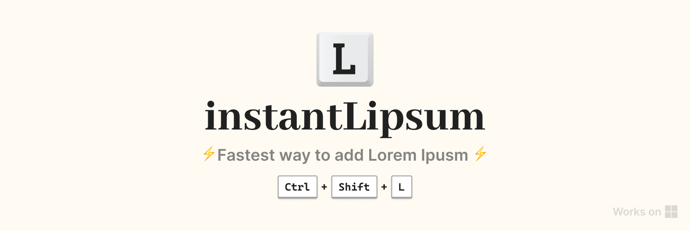

### instantLipsum - Fastest way to add lorem ipsum ⚡

If you wish to paste lorem-ipsum somewhere, but don't want to go through some website or wait for any plugin to load, just open instantLipsum and hit the keyboard shortcut: **`Ctrl`+`Shift`+`L`**.

[Download](https://drive.google.com/uc?export=download&id=1vEW3JFS7Hjv2ftT39PUcofppJEYhufJn) 
#### `Ctrl`+`Shift`+`L` → paste lorem ipsum.

This is a very simple implementation of `AutoHotKeys`, an automation scripting language for Windows. This is how it works, **`Ctrl`+`Shift`+`L`** →
1. Save the existing clipboard content.
2. Replace the clipboard with lorem-ipsum text (currently it's static, not randomly generated).
3. Paste.
4. Restore the clipboard content.

---

There are many customization that can be done, although some of which might not be possible with the limited scope of `AutoHotKeys`, & would require making a .NET app:
- [ ] randomly generated lorem-ipsum
- [ ] customizable lorem-ipsum: short, medium, long (choosing with different amount of hold on `L`?)
- [ ] allowing to customize shortcut
- [ ] feedback when pasted
- [ ] improving the first time ux: adding a demo-like showcase
